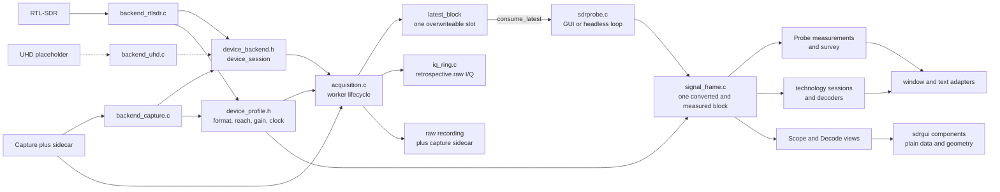
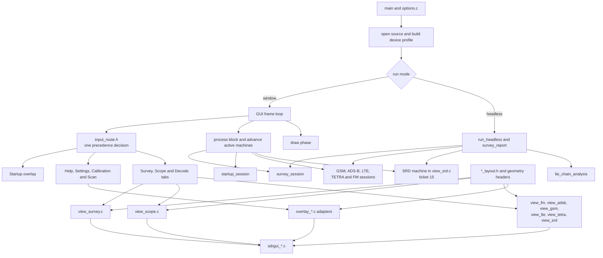
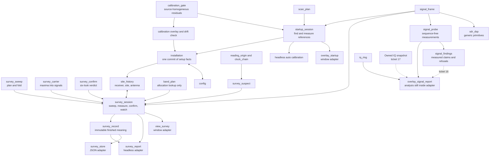
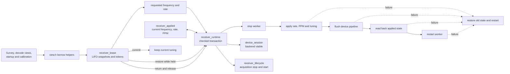

# sdrprobe architecture

A raylib front end over a receiver or capture: it acquires raw I/Q, surveys the
radio environment, shows one tuning four ways, recovers transmitted information
from several radio technologies, and calibrates the receiver's frequency error
against cellular references. RTL-SDR is the live backend; capture playback is
the second source, and the optional UHD backend remains a placeholder until it
can be developed against hardware.

For dump1090's internals — the acquisition conventions this program copies, and
the Mode S physical layer — see `dump1090-reference.md`. That source is not in
this repository.

## How to read the diagrams

An arrow means that the source calls, feeds, or adapts the target; it is not a
claim that every pair has a direct C include. Boxes with solid borders are
shipping modules. Dashed boxes name application adapters or an explicitly
recorded gap. The diagrams overlap on purpose: the first follows samples, the
next follows application control, and the remaining three expand the domain
and receiver relationships without one unreadable graph.

## Runtime and sample flow



`acquisition` owns the worker, raw recording, retrospective IQ ring and the
single block slot. A live worker never waits for the renderer: a slow GUI drops
blocks rather than lagging (ADR-0002). Lossless publication is enabled only for
headless file playback, where dropping a block would change a scripted answer.
Recording and the IQ ring tee off before the lossy slot.

`signal_frame` owns one consumed block after conversion: centred I/Q,
magnitudes and their statistics, the optional DC-filtered spectrum input, the
transform, peak hold and readiness. Presentation chooses the transform size;
the module reports a geometry change instead of knowing what is on screen.

## Application control and presentation



Input is resolved before drawing. `input_route.h` gives startup, help,
settings, calibration/scan, tab switching and per-screen input one checked
precedence order. It is the coordination rule; the overlays do not need a
generic overlay manager.

Views and overlays are application adapters. They may read `struct app`, turn
input into intents and draw state. Reusable `sdrgui_` components may not see
`struct app` (ADR-0007); they take plain data and geometry. Layout headers are
pure functions of window size, so `make check-layout` reaches them without a
window.

The headless paths are peer adapters, not a second application architecture.
They consume the same survey, startup, technology-session and LTE-chain
modules, then print rather than draw. SRD is the current exception: both the
window and headless output pass through decode state owned by `view_srd.c`.

## Probe module relations



The Probe context stops at measurements. `signal_probe` contains operations
that need no known sequence; `signal_findings` states only what those
measurements support. The band plan remains a frequency-to-allocation lookup,
never evidence that a carrier is the technology named by the allocation
(ADR-0015).

`survey_session` says where it wants the receiver tuned but never touches it;
the window and headless adapters perform the retune and report the result.
`survey_record` fixes the meaning of a finished sweep before text or JSON sees
it. `startup_session` similarly decides the GSM-first, LTE-fallback reference
search while its adapters own acquisition and presentation (ADR-0024).

The dashed retrospective-analysis path records the 2026-09-15 review rather
than pretending it is complete. Today the waterfall popup makes its findings
inside a raylib file, and `iq_ring_extract_slice()` asks that adapter to size a
buffer and reconstruct the sample metadata. Tickets 16 and 17 move those two
responsibilities behind checked, application-independent interfaces.

## Decoder module relations

```mermaid
flowchart TD
    frame[signal_frame<br/>centred I/Q] --> gsmS[gsm_session]
    frame --> adsbS[adsb_session]
    frame --> lteS[lte_session]
    frame --> tetraS[tetra_session]
    frame --> fmS[fm_session]
    frame --> srdV[SRD machine in view_srd<br/>ticket 15]

    core[sdr_dsp<br/>shared primitives] --> gsmD[gsm_dsp<br/>FCCH and SCH]
    core --> adsbD[adsb_dsp<br/>Mode S frames and CPR]
    core --> lteD[lte_dsp<br/>cell search and PBCH soft bits]
    core --> tetraD[tetra_dsp<br/>carrier to dibits]
    core --> fmD[fm_dsp<br/>multiplex and RDS soft bits]
    core --> srdD[srd_dsp<br/>transmissions, OOK and 2-FSK]

    gsmD --> gsmS
    gsmB[gsm_bcch<br/>System Information] --> gsmS
    adsbD --> adsbS
    lteD --> lteS
    mib[lte_mib<br/>Master Information Block] --> lteS
    tetraD --> tetraS
    tetraSync[tetra_sync<br/>network information] --> tetraS
    fmD --> fmS
    fmD --> fmAudio[view_fm audio adapter]
    rds[rds<br/>station information] --> fmS
    srdD --> srdV
    srdFrame[srd_frame<br/>full and repeat frames] --> srdV

    gsmS --> gsmA[view_gsm and headless decode]
    adsbS --> adsbA[view_adsb and headless decode]
    lteS --> lteA[view_lte and headless decode]
    tetraS --> tetraA[view_tetra and headless decode]
    fmS --> fmA[view_fm RDS and headless decode]
    srdV --> srdA[SRD view log and headless output]

    frame --> chain[lte_chain_analysis<br/>public multi-cell walk]
    lteD --> chain
    mib --> chain
    lteRules[lte_confirm, lte_stats<br/>and repeat rule] --> chain
    chain --> live[--lte-chain adapter]
    chain --> probe[probe-lte-chain adapter]
```



Each technology exposes the operations its standard needs. There is no common
technology interface: the modules share dependency and testability boundaries,
not a function table (ADR-0023). GSM, ADS-B, LTE, TETRA and FM have stateful
block sessions used by both window and headless adapters. SRD still performs
its cross-block run assembly and frame deduplication in its view; ticket 15 is
the missing sixth session.

`lte_chain_analysis` is not the normal LTE session. It walks every identity on
a carrier and accumulates public evidence for live and capture diagnostics.
The white-box capture probe keeps private correlation landscapes and control
experiments outside that interface.

## Receiver control and ownership



`receiver_runtime` owns no applied state: it performs the stop/apply/flush/
read-back/restart transaction over borrowed state and rolls back every partial
failure. Moving applied state behind it remains deliberately deferred until a
real UHD backend establishes which semantics transfer from RTL-SDR.

`receiver_lease` answers a different question: where a temporary owner must
put the receiver back. It is a strict LIFO stack of prior frequency/rate
snapshots. Out-of-order return changes neither hardware nor stack; a failed
restore leaves the token live and retryable. PPM is not leased, because a
calibration deliberately survives the overlay that measured it. Commit means
"keep this tuning and release the claim"; the Survey tab's **Open waterfall**
is its canonical caller.

## Layers, and what each may know

**Source and receiver control** (`device_backend.h`, `backend_*.c`,
`device_profile.h`, `receiver_runtime.c`, `receiver_lease.h`) knows device
operations and applied settings, not charts or technology decodes. The backend
is a vtable because live RTL-SDR and fixed capture sources already have
different behavior. The profile is data because format, full scale, tuning
reach, gain and reference clock are facts rather than operations.

**Acquisition and frame assembly** (`acquisition.c`, `iq_ring.c`,
`signal_frame.c`) knows sample containers and blocks, not tabs. Acquisition
owns thread and continuity policy; `signal_frame` owns one converted block;
the IQ ring owns retrospective raw samples.

**Probe domain** (`signal_probe.c`, survey, calibration, installation and band
plan modules) measures signals without interpreting standardized transmitted
information. Its state machines do not touch a receiver or a file directly.

**Decoder domain** (technology DSP, message decoders and sessions) turns known
modulation into synchronization identities, symbols, bits, messages and audio.
It knows no application state. The FFT and estimators remain self-contained
(ADR-0003), and DSP/session checks link without raylib or librtlsdr.

**Application adapters** (`sdrprobe.c`, `view_*.c`, `overlay_*.c`,
`survey_report.c`) connect receiver, modules, persistence, input and output.
Views and overlays may read `struct app`; that is their role, not a reusable
presentation interface.

**Presentation** (`sdrgui_*.c`, `*_layout.h`, geometry headers) takes plain
data and geometry. Components never see `struct app` (ADR-0007), and layout
decisions remain reachable without a window (ADR-0012).

**Persistence and diagnostics** (`config.c`, `installation.c`,
`site_history.c`, `survey_store.c`, `capture_sidecar.h`, `debug_log.c`) store
configuration and evidence. `installation_commit()` is the one writer for
installation facts; survey JSON and capture sidecars are adapters over records,
not owners of measurement meaning.

## State ownership

`struct app` is the application composition root. Views still share that one
record, so splitting them into files organizes coupling rather than making each
view an independent module. The important difference from the old design is
that decisions and long-lived machines now sit in named, directly checked
objects inside or beside it.

| state | declared in | owns or delegates |
| --- | --- | --- |
| `device_session`, `device_profile` | backend/profile headers | source operations and receiver facts |
| `receiver_applied` | `receiver_runtime.h` | current frequency, sample rate and correction |
| `receiver_lease` | `receiver_lease.h` | nested temporary tuning ownership |
| `acquisition` | `acquisition.h` | worker, latest block, recording and IQ ring |
| `signal_frame` | `signal_frame.h` | one converted block and generic derived measurements |
| `survey_view` | `app.h` | fields, menus, selection, lease and `survey_session` |
| `startup_view` | `app.h` | form state, lease and `startup_session` |
| `scope_view` | `app.h` | chart window, GPU resources and display history |
| `gsm_view` | `app.h` | inspected channel, controls, log and `gsm_session` |
| `adsb_view` | `app.h` | message presentation, trace selection and `adsb_session` |
| `lte_view` | `app.h` | band scan, controls, lease, statistics and `lte_session` |
| `tetra_view` | `app.h` | chart/log presentation and `tetra_session` |
| `fm_view` | `app.h` | scan, audio, controls, charts and `fm_session` |
| `srd_view` | `app.h` | controls, charts, log and the decode machine pending ticket 15 |
| `calibration`, `band_scan` | `app.h` | calibration/drift state and GSM reference scan |
| `settings_panel`, `help_overlay` | `app.h` | transient overlay input and presentation state |
| `waterfall_signal_context` | `app.h` | context menu and report presentation pending tickets 16–17 |
| `installation`, `config`, `options` | their headers | setup identity, persisted choices and parsed command line |

Handoffs that genuinely cross screens remain in `struct app`: applied receiver
state, selected channels, calibration health, source labels, active tab/decode
kind and process lifecycle. A field read only by its owner is not automatically
misplaced; a decision duplicated across adapters or trapped inside drawing is
the extraction signal.

## Two bounded contexts

`CONTEXT-MAP.md` splits the domain. The **Probe** context acquires, surveys and
measures signals, stopping before modulation is interpreted as transmitted
information. The **Decoder** context owns that interpretation, including
synchronisation identities, symbols and bits, messages, and audio (ADR-0021).
The vocabulary is enforced by glossaries with explicit `_Avoid_` lines: the
scatter view is never a "constellation" in Probe language, and a sample block
is never a "packet".

## Verifying changes

```
make check-touched     checks selected from the files changed
make check-dsp         hardware-free DSP checks, -lm only
make check-layout      screen geometry without opening a window
make check-pipelines   assembled program over recorded captures
make check-signal-frame one converted and measured sample block
make check-survey-session sweep, confirmation, watch and measurement
make check-receiver-runtime receiver transitions and rollback
make check-lte-chain-analysis public LTE chain over both captures
make probe-gsm-chain   a walk through the SCH decode chain (diagnostic)
```

The DSP checks include two real captures. Those assertions matter more than
they look: the SCH decoder's field layout was wrong for months while every
synthetic test passed, because the test's encoder shared the decoder's mistake.
What caught it was checking the decode against something the code cannot
influence — the burst's own position in the capture. A check that only compares
the program against itself will agree with any consistent error.

Layout has the same property. It was tuned by eye until `check-layout` pinned
it; now a change that moves a rectangle says which one and by how much.

## Decisions

`docs/adr/` records architectural decisions. The ones that constrain new work
most:

- **0002** the acquisition handoff is one overwriteable slot, not a queue
- **0003** the DSP is self-contained; no external DSP library
- **0004** calibration's stability gate needs a source-homogeneous residual buffer
- **0005** the rendering seam carries raw centred I/Q, not a reduced frame
- **0007** presentation components never see application state
- **0011** *superseded* — a soft-decision receiver was specified to fix the SCH
  frame number; the real fault was the field layout, and the measurement that
  rejected the proposed fix is recorded with it
- **0012** every decision the program makes is reachable by a check that needs
  no window, no receiver and no person
- **0014** LTE runs on LTE's own 1.92 MS/s grid and refuses anything else
- **0015** the band plan is a lookup; a carrier inside an allocation has not
  thereby been identified
- **0018** calibration profiles identify both receiver and receiving site
- **0019** survey confirmation preserves intermittent as a third verdict
- **0020** Survey is a top-level tab while remaining part of Probe
- **0021** Decoder owns transmitted information, not only messages
- **0022** receiving setup history is keyed by receiver, site, and antenna
- **0023** technology DSP modules share boundaries, not a uniform interface
- **0024** a windowed receiver session begins at a known installation
